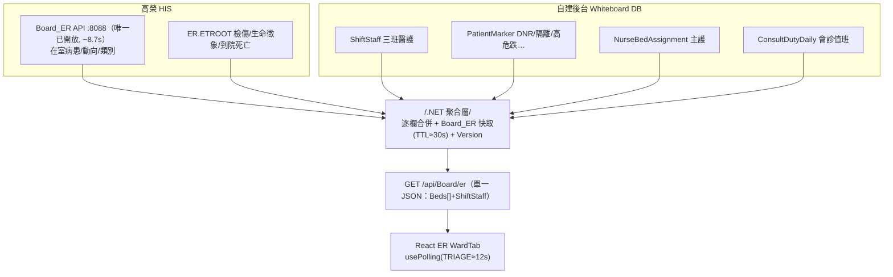

# ER 急診動態 — 試作 JSON 與資料組裝

> 比照 [[W52病室動態-JSON與組裝]] 的方法（後端聚合 BFF＋逐欄合併 COALESCE＋快取＋詳情 lazy），本頁聚焦 **ER 特有**：**ER 是目前唯一有開放 API 的站**（[[Board_ER]]，`:8088`），但回應慢（~8.7s）且部分代碼待確認；急診 DNR 等旗標經院方確認為**空值**（[[欄位資料實況]]）。

## ⚠ 實測更新（2026-06-22）
✅ 檢傷 `ER.ETROOT`（鍵＝**`ETHISNUM`**）全欄可用；床/科別/主治/診斷（`AM.*`）可用。⛔ 急診 DNR 空→自建；`ER.ETROOTS` 僅 FRANK/SAO2 有值、其餘空且**無病歷號欄**；轉院 `HOSPTRIN`/`HOSPTROU` 空、候床 `HWBDDT` 異常；過敏多 `NIL`、`BIMBA.ERDISPAT` **不存在**。詳 [[欄位資料實況]]。

## ⚠ 版面更新（2026-07，已上線）— 三班醫護面板＋各科值班醫師面板
- 右上「**三班醫護人員**」面板（`staff-shifts`）：
  - **醫師/照服員結構** ← `getErShiftPanel('ER')` → `[{ shift, time, doctor, aide }]`；標題右側只顯示 **白班/夜班醫師**＋**照服員**（白班/夜班；有「照服員」標籤）。
  - **各班護理師具名** ← `getSchedule('ER')`（三班護理師排班，非 ShiftStaff）；含 **12:00–20:00 第 4 班**（無班別者每行 1 名，有班別每行 2 名）。
- 「**各科值班醫師**」面板（`oncall-panel`，MER09 下方 5×2）：引用**中央值班排程當日值班**（`getOnCallBoardForUnit('ER')` → `[{ deptCode, deptName, doctorName, ext }]`），顯示 **代碼 科別／醫師 #分機**；ER 後台「顯示值班醫師」可選 **≤10 科**。詳 [[急診值班表-JSON]]。
- **死亡類別彈窗**（`DeceasedModal`）：Board_ER_TypeE（**不佔床**），底部「死亡」旗標開啟，列病歷號＋轉出(死亡)日期時間＋病房床；`deceasedCount` 計數。
- **不佔床病人面板**（`unplaced-panel`，負1 下方）：床碼未建主檔者以簡易清單列出，可點開詳情。
- **責任護理師 `Nurse` 可多位**（一床多主護，逗號並列）。**值班醫師排程/夜假護理師排程為全院共用中央資料（ER 管理維護）**，各站以「顯示值班醫師/顯示照服員/顯示聯絡電話」引用。

## 一、試作 JSON（貼合前端 `mockData`，PascalCase）
```json
{
  "HospitalInfo": { "HospitalName":"高雄市立民生醫院", "WardName":"急診室", "WardCode":"ER", "WardDirector":"黃○誠", "HeadNurse":"吳○珊" },
  "Version": 1718000000,
  "Beds": [
    {
      "BedId":"MER01", "Zone":"急救室", "Status":"occupied",
      "Patient":{
        "PatientName":"王○進","Gender":"M","Age":73,"BirthDate":"1953/01/19","MedRecord":"C401234569",
        "ArrivalDate":"05/24","ArrivalTime":"11:08","Department":"心臟內科",
        "Diagnosis":"Cardiac arrest, ROSC, Post-CPR","Doctor":"黃○誠醫師","Nurse":"張○惠護理師",
        "Triage":1,
        "Observation":false,"Awaiting":true,"AwaitingType":"加護",
        "TransferIn":false,"TransferOut":false,"Admitted":false,"AdmBedNo":null,
        "Dnr":false,"Isolation":"無","FallRisk":false,"Allergy":false,
        "Aad":false,"Mbd":false,"Exam":true,"Consult":true,"Deceased":false,
        "Notes":"CPR 後 ROSC，準備轉 CCU"
      }
    },
    { "BedId":"負2","Zone":"負壓隔離室","Status":"isolation","Patient":{ "PatientName":"陳○文","Gender":"M","Age":58,"Triage":2,"Isolation":"負壓隔離","Awaiting":true,"AwaitingType":"隔離","Consult":true,"Notes":"疑似肺結核" } },
    { "BedId":"MER07","Zone":"第一診療區","Status":"empty","Patient":null }
  ],
  "ShiftPanel": [
    { "shift":"大夜","time":"23:00–07:00","doctor":"黃○誠醫師","aide":"楊○雲" },
    { "shift":"白班","time":"07:00–15:00","doctor":"張○哲醫師","aide":"林○芳" },
    { "shift":"小夜","time":"15:00–23:00","doctor":"林○泰醫師","aide":null },
    { "time":"12:00–20:00" }
  ]
}
```
> 註（現況）：三班醫護面板拆兩源——**醫師/照服員/班別結構** ← `getErShiftPanel`（`ErShiftPanel`，上例 `ShiftPanel`）；**各班護理師具名** ← `getSchedule('ER')`（三班護理師排班，含 12:00–20:00 第 4 班）。舊的 `ShiftStaff[].ChargeNurse/NurseCount` 已由這兩源取代。**各科值班醫師**另由 `getOnCallBoardForUnit('ER')` 供給（見上「版面更新」）。

## 二、逐欄資料來源（三態 × 表）
| 欄位 | 來源 | 表.欄位 / 自建 | 現況 |
|---|---|---|---|
| BedId / Zone | HIS+自建 | 床號↔`AM.HLOC.HBED`（對應待確認）；Zone 分區為自建對應 | 待確認 |
| Status（留觀/待床/轉出） | HIS | **Board_ER `病患動向`/`類別` 代碼** | **代碼表待確認** |
| PatientName/Gender/Age/BirthDate/MedRecord | HIS | `AM.HPBASIC`（Board_ER 回傳） | ①有值 |
| ArrivalDate/Time | HIS | `ER.ETROOT` ETDATE/ETTIME | 候選 |
| Triage（1–5→A/B/C） | HIS | `ER.ETROOT` ETRANK | ✅可（Board_ER）|
| Diagnosis / Doctor / Department | HIS | 主訴/看診醫師/`ETSECT` | 候選 |
| Observation/Awaiting/AwaitingType | HIS | Board_ER 動向代碼（一般/加護/隔離） | 代碼待確認 |
| TransferIn/Out/Hospital | HIS | `HCASE` HOSPTRIN/HOSPTROU、`ETROOTS` TURNHID | 候選 |
| Admitted/AdmBedNo | HIS | `HCASE` HDISADM、`HDISCHRG` HDISBED/HDISWARD | 候選 |
| Aad / Mbd | HIS | 出院區分 `HDISCHRG` HDISTYPE？ | **對應待確認** |
| Deceased | HIS | `ETROOT` ETDOA、`ETROOTS` ISOHCDIE | 候選 |
| Allergy | HIS候選 | `ER.ETROOT` ETDRUG、`BIMBA.ERDISPAT` ETDRUGC | 候選(可能空) |
| Exam / Consult 旗標 | HIS候選 | `OR.ORDER` / `NonExSchList` | 候選 |
| **Dnr** | 自建 | (急診 DNR ②**空值**) → `PatientMarker` | ②→自建 |
| **Isolation / FallRisk** | 自建 | (護理紀錄/評估 ③) → `PatientMarker` | ③→自建 |
| **Nurse** 主護 | 自建 | 床位指派＋人員主檔（**可多位，逗號並列**）| ③→自建 |
| **三班醫護面板** | 自建 | 醫師/照服員/班別 ← `ErShiftPanel`（`getErShiftPanel`）；護理師 ← 三班護理師排班（`getSchedule`，含 12:00–20:00）| ✅ 已上線 |
| **各科值班醫師面板** | 自建/引用 | **中央值班排程**（`OnCallDept`/`OnCallRoster`）→ `getOnCallBoardForUnit`；後台選 ≤10 科 | ✅ 已上線 |
| 死亡類別（不佔床） | HIS | Board_ER_TypeE → `DeceasedModal`（病歷號/轉出時間/病房床）| ✅ 已上線 |

## 三、API 組合策略（ER 特有）
- **唯一可即時取的列表級＝[[Board_ER]]**（POST，`x-api-key`，`:8088`）。但 **回應 ~8.7s**：後端**必須快取**（TTL≈30s），白板輪詢（檢傷頁 10–15s，[[即時更新-輪詢設計]]）打的是快取、不直接壓 HIS。
- 後端聚合 `GET /api/Board/er`：Board_ER（在室病患）＋ `ER.ETROOT`（檢傷/生命徵象）＋ 自建（`ShiftStaff`/`PatientMarker`/`NurseBedAssignment`/`ConsultDutyDaily`）→ 逐欄合併。
- **待釐清（影響可用性）**：Board_ER `病患動向`/`類別` 代碼表、`Aad/Mbd` 對應、床號↔`HLOC.HBED`、**是否回全部在室病患（目前疑只回 1 筆）** → [[待辦清單]] E 區。
- 大量傷患（MassCasualty）另頁，檢傷＋基本可由同來源彙整。

## 四、組裝流程圖


## 五、落地註記
- ER 列表級**現在就能接 Board_ER**（其餘站尚不可）；先把 Board_ER 串起、快取，再疊自建註記/三班/會診。
- 急診 DNR 空值、隔離/高危跌未開放 → 一律自建（`MANUAL_ONLY`）。

相關：[[Board_ER]] · [[W52病室動態-JSON與組裝]] · [[資料庫Schema]] · [[欄位資料實況]] · [[ER]] · [[00-總覽]]
