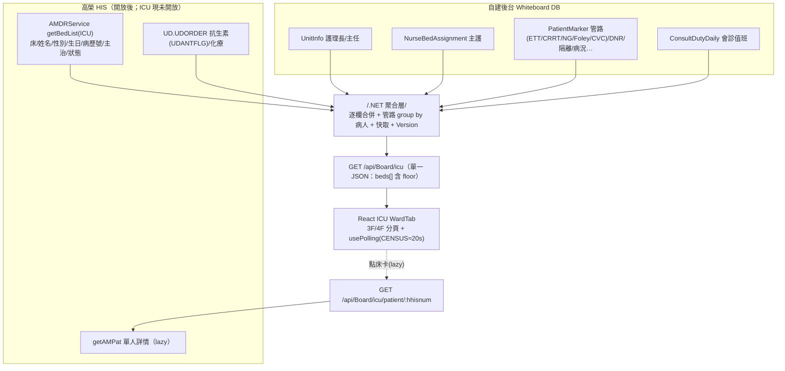

# ICU 病室動態 — 試作 JSON 與資料組裝

> 比照 [[W52病室動態-JSON與組裝]] 的方法。ICU 特有：**管路（呼吸器/CRRT/NG/Foley/CVC）為白板核心、但全在護理紀錄系統未開放 → 必自建**；病況等級 C/B/A、3F/4F 分頁、會診醫師區、策略病人。抗生素另有 `AntibioticTab`（`UD.UDORDER`）。
> 注意：ICU `mockData` 採 **camelCase**（`patient.name`/`doctor`/`ventilator`…），與 W52/OR/ER 的 PascalCase 不同，JSON 須對應。

## ⚠ 實測更新（2026-06-22）
✅ 確認可用：床位 `AM.HLOC`、科別 `HSECTION`、**主治 `HDOCTOR`(HDOCNAMC/HMDTYPE)**、診斷 `HDIAGNOS`。⛔ 空值→自建：DNR、保密、安寧、血型/身高體重、轉院、候床(HWBDDT 異常)。管路本就自建（護理紀錄未開放）。抗生素旗標 `UDANTFLG` 空→改藥名比對（見 [[抗生素-JSON]]）。詳 [[欄位資料實況]]。

## 一、試作 JSON（貼合前端 `mockData`，camelCase）
```json
{
  "hospitalInfo": { "name":"高雄市立民生醫院", "ward":"ICU", "wardDirector":"王○明", "headNurse":"陳○美" },
  "version": 1718000000,
  "beds": [
    {
      "id":"F4-01", "floor":4, "num":1, "status":"occupied",
      "patient":{
        "name":"林○志","gender":"M","age":72,"birthDate":"1953/08/12","medRecord":"A234567890",
        "department":"胸腔內科","admission":"05/10","diagnosis":"Septic shock, Pneumonia",
        "doctor":"蘇○醫師","nurse":"陳○護理師","condition":"重症",
        "dnr":false,"isolation":"無","fallRisk":false,"dependency":null,
        "ventilator":true,"crrt":false,"ng":true,"foley":true,"cvc":true,
        "npo":true,"allergy":false,"chemo":false,"rrt":false,
        "transport":null,"oxygen":false,"confidential":false,"noTreatment":false,
        "surgery":false,"exam":false,"consult":false,"notes":""
      }
    },
    { "id":"F3-05","floor":3,"num":5,"status":"occupied","patient":{ "name":"黎○達","gender":"M","age":68,"condition":"重症","doctor":"周○醫師","nurse":"林○護理師","ventilator":true,"ng":true,"foley":true,"cvc":true,"surgery":true,"notes":"" } },
    { "id":"F4-03","floor":4,"num":3,"status":"empty","patient":null }
  ]
}
```
> `floor`(3/4) 供 3F/4F 分頁；4F 主頁、3F 平時無病人預設隱藏（第5次會議）。床數合計、顯示分開。

## 二、逐欄資料來源（三態 × 表）
| 欄位 | 來源 | 表.欄位 / 自建 | 現況 |
|---|---|---|---|
| id / floor / num | HIS+自建 | 床號 `AM.HLOC.HBED`；floor 由床號/自建對應 | 待確認 |
| name/gender/age/birthDate/medRecord | HIS | `AM.HPBASIC` | ①有值 |
| department | HIS | `AM.HSECTION` HCURSVCL/HCURDESC | 候選 |
| admission | HIS | `AM.HCASE` HADMDT | 候選 |
| diagnosis | HIS | `AM.HDIAGNOS` HDIAGTXT | 候選 |
| doctor 主治 | HIS | `AM.HDOCTOR` HDOCNAMC(+HMDTYPE) | 候選 |
| status（轉出/出院） | HIS | `HCASE` HPATSTAT、`HDISCHRG` | 候選 |
| **nurse** 主護 | 自建 | `NurseBedAssignment`＋`NurseStaff` | ③→自建 |
| **condition** 病況 C/B/A | 自建 | (無 HIS 欄位) → `PatientMarker`/留空 | 自建 |
| **dnr** | 自建 | (HPBASIC.HDNRSIGN ②**空值**) → `PatientMarker` | ②→自建 |
| **isolation / fallRisk** | 自建 | (護理紀錄/評估 ③) → `PatientMarker` | ③→自建 |
| **ventilator(ETT) / crrt / ng / foley / cvc** ★管路 | 自建 | (護理紀錄 ③；字典 0 筆) → `PatientMarker`(LINE) | ③→自建 |
| npo | HIS候選/自建 | `OR.OPORDER` ORNPODT | 候選 |
| allergy | HIS候選 | `MR.EMRTRE` HALERGY | 候選(可能空) |
| chemo | HIS候選 | `UD.UDORDER` UDDCJUST | 候選 |
| 抗生素（AntibioticTab） | HIS候選 | `UD.UDORDER` UDANTFLG＋藥名＋UDBGNDT/UDENDDT | 候選 |
| rrt / transport / oxygen / dependency / confidential / noTreatment | 自建 | `PatientMarker`（②/③） | 自建 |
| surgery / exam / consult 旗標 | HIS候選 | `OR.OPORDER` / `OR.ORDER` | 候選 |
| 會診醫師區（待辦） | 自建 | `ConsultDutyDaily`（科別→醫師） | 自建 |
| 策略病人（待辦） | 自建 | `PatientMarker` STRATEGIC | 自建 |

## 三、API 組合策略（ICU 特有）
- 同 W52：後端聚合 `GET /api/Board/icu` = `AMDRService getBedList(ICU)`（開放後，列表級）＋ 自建批量（`PatientMarker` 管路/註記、`NurseBedAssignment`、`UnitInfo`、`ConsultDutyDaily`）→ 逐欄合併＋快取。**勿逐床 `getAMPat`×25**；詳情 modal 才 lazy。
- **管路是 ICU 核心且全自建** → `PatientMarker` 以 `MarkerCode=LINE`、`MarkerValue=ETT/CRRT/NG/Foley/CVC` 表示，聚合時 group by 病人轉成布林旗標。
- 抗生素（`AntibioticTab`）：`UD.UDORDER` UDANTFLG 過濾，可另一支 `GET /api/Board/icu/antibiotic` 或併入詳情（量大時 bulk by unit）。
- 3F/4F：同一 JSON 含 `floor`，前端分頁切換（不需兩支 API）。

## 四、組裝流程圖


## 五、落地註記
- 管路/病況/主護/會診值班/策略病人**現可自建**；病人基本+主治待 AMDR 開放。
- 3F（5 床）平時無病人預設隱藏、4F（20 床）主頁；床數合計分開顯示。

相關：[[W52病室動態-JSON與組裝]] · [[資料庫Schema]] · [[欄位資料實況]] · [[ICU]] · [[00-總覽]]
