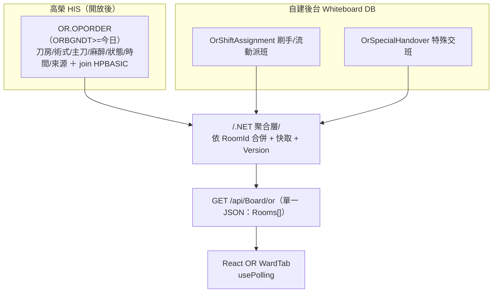

# OR 手術動態 — 試作 JSON 與資料組裝

> 比照 [[W52病室動態-JSON與組裝]] 的方法。OR 特有：以**刀房**為單位（7 間 OR-01/02/03/05/06/07/08）；手術資訊來自 `OR.OPORDER`；**刷手/流動護理師高榮無 API → 必自建**；特殊交班源自流動護理師護理紀錄、撈不到先留白。

## ⚠ 實測更新（2026-06-22）
✅ `OR.OPORDER` 核心**可用**（刀房 OROPROOM/術式 OROPNM1/主刀 ORDOCNM/助手/麻醉/狀態 ORSTATUS/來源 ORCASETP/起始時間 ORBGNDT-TM）；鍵＝**`ORHISNUM`**。⚠ NPO `ORNPODT/ORNPOTM` 異常、`ORDIAG`/`OREMRFG`/`ORBIO` 部分空。刷手/流動/特殊交班仍自建。詳 [[欄位資料實況]]。

## ⚠ 版面更新（2026-07，已上線）— 房卡放大＋第 8 格溫溼度＋新頁籤
- **7 刀房 4×2 卡片地圖 ＋ 第 8 格「溫溼度」摘要卡**（`EnvCard`）：各房溫度/溼度來自後台「溫溼度記錄」`OrRoomEnv`（`getOrRoomEnv` → `/or/temphumidity` → `[{ opDate, roomId, temperature, humidity }]`；缺值顯示「—」）。詳 [[或-溫溼度記錄]]／MEMORY。
- **房卡字放大**；依**手術來源**上色（`src-er` 急診刀／`src-op` 門診刀／`src-inp` 住院刀）。房卡帶**科別（ORCATGY）/診斷（ORDIAG）**。
- **狀態值**（`Status`／`SurgeryStatus`）：`in-surgery`（手術中）／`scheduled`（排程，卡片顯示準備中/排程）／`completed`（已完成）／`empty`（空房）。
- **已完成僅依 `EndTime`**（有結束時間即完成）；**取消刀 `ORSTATUS=82` 一律排除**（不進看板；手術清單以刪節線標示）。
- 房卡點開 `RoomModal`：顯示今日該房**全部台次可切換**（`Surgeries[]`），預設停在房卡當下那台（手術中/保留期）；欄位含診斷/術式/刷手/流動/麻醉/來源/排程・開始・結束時間・時長/備註。
- **新增頁籤**：`surgerylist`「**手術清單**」（診斷欄＋總/住/門/急統計＋日期範圍＋**xlsx 匯出**；讀本地清洗表 `OrSurgery`，見 [[OR-手術清單]]）、`assist`「**各科協助業務**」（圖片）。**手術派班／特殊交班已上線（非 mock）**，見 [[手術派班-JSON]]、[[特殊交班-JSON]]。
- **檢視密碼**：非第一頁（手術動態以外頁籤）若後台設密碼且未解鎖，以數字鍵盤 `OrViewGate` 取代內容（`UnitInfo.viewPassword`／`viewTimeoutMinutes` 1–10 分，per-device sessionStorage）。

## OPORDER 名單來源（base SQL，★含日期過濾）
OR 名單＝`OR.OPORDER` 以 **`ORBGNDT`(預定手術日) ＋ `ORHISNUM`(病歷號)** 兜出，**必加日期過濾排除過去刀單**（OPORDER 累積所有歷史刀單，不濾會全撈）：
```sql
SELECT
    op.OROPROOM AS 刀房, op.ORHISNUM AS 病歷號,
    b.HNAMEC, b.HSEX, b.HBIRTHDT,
    op.OROPNM1  AS 術式, op.ORDOCNM AS 主刀,
    op.ORADRNM1, op.ORADRNM2, op.ORADRNM3, op.ORADRNM4, op.ORADRNM5,
    op.OROPAMED AS 麻醉, op.ORCASETP AS 來源, op.ORSTATUS AS 狀態,
    op.ORBGNDT, op.ORBGNTM AS 排定, op.ORDIAG AS 診斷   -- 診斷部分空
FROM [DB2_DUMP].[OR].[OPORDER_4A0] op
LEFT JOIN [DB2_DUMP].[AM].[HPBASIC_4A0] b ON op.ORHISNUM = b.HHISNUM
WHERE op.ORBGNDT >= CONVERT(char(8), GETDATE(), 112)   -- ★排除當日以前（格式以實際 ORBGNDT 為準）
ORDER BY op.OROPROOM, op.ORBGNTM;
```
- ★ **日期過濾必加**：`ORBGNDT >= 今日`（排除過去）；若只要「純今日刀表」改 `= 今日`。
- `ORBGNDT` 型別/格式需對齊（字元 `yyyymmdd` 用上式；日期型改 `CAST(GETDATE() AS date)`）。
- 一手術若多列 → 用 `ROW_NUMBER()` 取最新去重（**勿用 MAX 詞典序**，會取錯）。
- 取消刀（ORSTATUS=取消）依需求決定顯示與否；科別/實際進出刀時間另議（見下）。

## 一、試作 JSON（貼合前端 `mockData`，PascalCase）
```json
{
  "HospitalInfo": { "HospitalName":"高雄市立民生醫院", "WardName":"手術室", "WardCode":"OR", "WardDirector":"林○泰醫師", "HeadNurse":"陳○雅護理長" },
  "Version": 1718000000,
  "Rooms": [
    {
      "RoomId":"OR-01", "Status":"in-surgery",
      "Patient":{
        "PatientName":"王○明","Gender":"M","Age":65,"BirthDate":"1961/02/15","MedRecord":"A201234601","Department":"一般外科",
        "Diagnosis":"Acute cholecystitis","SurgeryName":"腹腔鏡膽囊切除術 LC","Doctor":"黃○誠醫師",
        "ScrubNurse":"張○惠護理師","CircNurse":"李○婷護理師",
        "AnesType":"全身麻醉 (GA)","SurgerySource":"住院刀","SurgeryStatus":"手術中",
        "ScheduledTime":"08:30","StartTime":"09:05","EndTime":null,
        "Notes":"術前停 Aspirin 7 天，血壓控制良好"
      }
    },
    { "RoomId":"OR-05","Status":"scheduled","Patient":{ "PatientName":"吳○秀","Gender":"F","Age":58,"SurgeryName":"二尖瓣置換術 MVR","Doctor":"黃○誠醫師","SurgerySource":"住院刀","SurgeryStatus":"準備中","ScheduledTime":"11:30","StartTime":null,"EndTime":null,"Notes":"ICU 床已預留" } },
    { "RoomId":"OR-04","Status":"empty","Patient":null }
  ]
}
```
> 註：OR-04 已移除（7 間），空房可不回或回 `empty`。房卡另可帶 `TodayCount`（今日台數，>1 顯示「今日 N 台」）與 `Surgeries[]`（今日全台次，供 Modal 切換）；`Patient` 為房卡當下顯示那一台。`Status` 值＝`in-surgery`/`scheduled`/`completed`/`empty`。

## 二、逐欄資料來源（三態 × 表）
| 欄位 | 來源 | 表.欄位 / 自建 | 現況 |
|---|---|---|---|
| RoomId 刀房 | HIS | `OR.OPORDER` OROPROOM | 候選 |
| Status（手術中/準備/已完成） | HIS | `OR.OPORDER` ORSTATUS | 候選 |
| PatientName/Gender/Age/BirthDate/MedRecord | HIS | `AM.HPBASIC` | ①有值 |
| Department | HIS | `AM.HSECTION` HCURSVCL/HCURDESC | 候選 |
| Diagnosis | HIS | `OR.OPORDER` ORDIAG / `AM.HDIAGNOS` | 候選 |
| SurgeryName 術式 | HIS | `OR.OPORDER` OROPNM1 | 候選 |
| Doctor 主刀（+助手） | HIS | `OR.OPORDER` ORDOCNM（ORADRNM1-5） | 候選 |
| AnesType 麻醉 | HIS | `OR.OPORDER` OROPAMED | 候選 |
| SurgerySource（急/門/住刀） | HIS | `OR.OPORDER` ORCASETP / OROPFLAG | 候選 |
| SurgeryStatus / 緊急刀 | HIS | `OR.OPORDER` ORSTATUS / OREMRFG | 候選 |
| ScheduledTime/StartTime/EndTime | HIS | `OR.OPORDER` ORBGNDT-TM（+狀態時間） | 候選 |
| 抗生素使用 | HIS候選 | `OR.OPORDER` ORBIO | 候選 |
| **ScrubNurse 刷手 / CircNurse 流動** | 自建 | `OrShiftAssignment`（+`NurseStaff`） | ③高榮無 API→自建 |
| **Notes / 特殊交班** | 自建 | `OrSpecialHandover`（盡量帶流動護理師紀錄，撈不到留白） | 自建 |
| 隔離/測謀（由病房帶入） | 自建 | `PatientMarker`/`OrSpecialHandover` 旗標 | ③→自建 |

## 三、API 組合策略（OR 特有）
- **OPORDER 一次 list query**：以 **`ORBGNDT >= 今日`**（排除過去刀單）一次撈，依刀房排列（7 間，量小）→ 不需逐房呼叫，效能佳。base SQL 見上節。
- 後端聚合 `GET /api/Board/or`：`OR.OPORDER`（手術）＋ 自建（`OrShiftAssignment` 派班、`OrSpecialHandover` 交班）→ 依 RoomId 合併。
- 派班/交班屬操作性、與 HIS 無相依 → 可先自建上線；OPORDER 開放後再疊手術資訊。
- 統計（急/門/住刀、進行中/準備/完成）由前端就回傳資料彙算（現 `getStats`）。

## 四、組裝流程圖


## 五、落地註記
- 刷手/流動護理師、特殊交班**現在即可自建上線**（高榮無對應）；手術資訊待 OPORDER 開放。
- OR-04 已移除，固定 7 間。

相關：[[W52病室動態-JSON與組裝]] · [[資料庫Schema]] · [[欄位資料實況]] · [[OR]] · [[00-總覽]]
