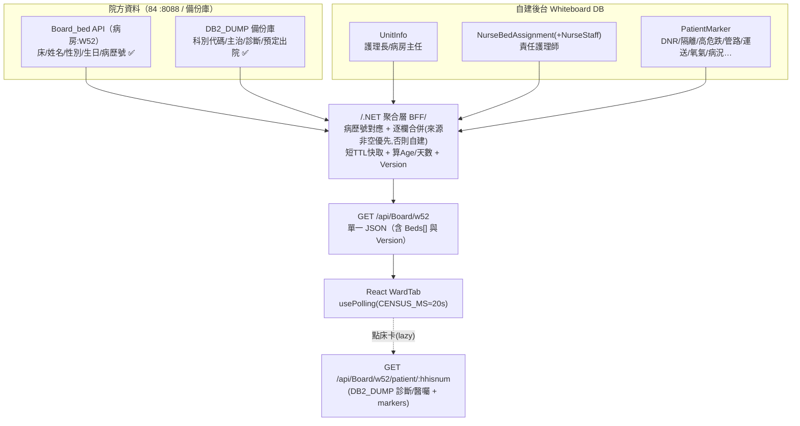

# W52 病室動態 — 試作 JSON 與資料組裝

> 目標：依**目前狀態**試作 W52 病室動態（`WardTab`）所需 JSON、逐欄資料來源、以及「一次取得 vs 組合」的 API 策略（含效能）。
> 前提：**在床清單＋病人基本可由 [[Board_bed]] API 取得**（2026-06 確認有真實資料）；科別/主治/診斷/預定出院由備份庫 DB2_DUMP（實測有值）；DNR/管路/隔離/責護/病況等空值或未開放 → 自建（[[欄位資料實況]]）。
> 關聯：[[資料庫Schema]]（自建表/合併策略）、[[HIS可用與缺漏分析]]、[[資料項對照表]]、[[即時更新-輪詢設計]]。

## ⚠ 實測更新（2026-06）
- **在床清單＋基本（姓名/性別/生日/病歷號/病房/床位）** ← [[Board_bed]] API（確認有真實資料、病房可參數化）；身分證個資不顯示、字串需 trim。
- **科別代碼 `HCURSVCL`、主治 `HDOCTOR`、診斷 `HDIAGNOS`、預定出院 `HDISRVDT`** ← DB2_DUMP 實測有值，以病歷號對應目前案件補。
- ❓**待確認（6/22 未驗有值）**：入院日 `HADMDT`、病人狀態 `HPATSTAT`、科別名稱 `HCURDESC`（空則自建/用代碼對照；住院天數隨 HADMDT）。
- ⛔**空值→自建**：DNR、保密、安寧、血型/身高體重、轉院(HOSPTRIN/HOSPTROU)、候床(HWBDDT 異常)、管路/隔離/責護/病況/註記。詳 [[欄位資料實況]]。

## ⚠ 版面更新（2026-07，已上線）— 值班表併入病室動態
- **值班表已改為 `WardTab`（病室動態）內的面板**（非獨立 `ScheduleTab`）：位於床位圖**右上 7×6 空區**（欄 8–14 × 列 1–6）；**統計區對調移到中間 4×8**。
- 值班表面板橫向 **3 欄**（實際為上下堆疊三段 `duty-sec`）：
  1. **三班護理師**（大夜 N／白班 D／小夜 E ＋ 第 4 班 **12:00–20:00**；每班可多人）＋標題右方「**夜專師**」＝夜/假護理師排程今日小夜（`getNightNurse` → `NightNurseRoster`）。其下 **緊急應變編組** 5 組：**通報班／滅火班／安全防護／救護班／避難引導**（由排班護理師之 `emergencyGroup` 歸類；目前一人一班，一人多班待後端擴充）。資料 ← `getSchedule('W52')`。
  2. **值班醫療團隊**：引用**中央值班排程**之當日值班醫師（科別＋醫師＋分機）；後台「W52 管理→顯示值班醫師」選科別＋順序（`getOnCallBoardForUnit('W52')` → `[{deptCode,deptName,doctorName,ext,mobile}]`）。
  3. **照服員**（後台「顯示照服員」`getUnitCareAides` → `[{aideId,name,contact}]`）＋ **聯絡電話**（後台「顯示聯絡電話」`getPhone('W52')` → `[{id,title,name,extension}]`）。
- **責任護理師 `PrimaryNurse` 可多位**（一床多主護，逗號並列顯示）。
- 詳見 [[排班資訊-JSON]]（三班/緊急編組）、[[醫師資訊-JSON]]（值班醫療團隊）、[[照護團隊-JSON]]（照服員/聯絡電話）。

## 一、試作 JSON（貼合前端 `mockData` 結構，可直接替換 `MOCK_DATA`）
```json
{
  "HospitalInfo": {
    "HospitalName": "高雄市立民生醫院",
    "WardName": "W52病房", "WardCode": "W52",
    "WardDirector": "吳○明", "HeadNurse": "林○芳"
  },
  "Version": 1718000000,
  "Beds": [
    {
      "BedId": "W52-001", "Status": "occupied",
      "Patient": {
        "PatientName": "林○志", "Gender": "M", "Age": 75,
        "MedicalRecordNo": "A112345678", "BirthDate": "1950/03/15",
        "Department": "骨科", "AdmissionDate": "05/08",
        "Diagnosis": "Hip fracture, Post-OP Day 3",
        "AttendingDoctor": "張○醫師", "PrimaryNurse": "陳○護理師",
        "Condition": "穩定",
        "Dnr": true, "Isolation": "無", "FallRisk": true, "Dependency": null,
        "Confidential": false, "NoTreatment": false, "Npo": false,
        "Allergy": false, "Rrt": false, "Chemo": false,
        "Transport": "輪椅", "Oxygen": false, "Renal": false,
        "PortCath": false, "DLVC": false, "Foley": false, "CVC": false, "CardiacCath": false,
        "Surgery": false, "Exam": false, "Consult": false,
        "Notes": ""
      }
    },
    { "BedId": "W52-006", "Status": "isolation", "Patient": { "PatientName": "王○豪", "Gender": "M", "Age": 58, "MedicalRecordNo": "C334567890", "Department": "感染科", "AdmissionDate": "05/10", "Diagnosis": "Cellulitis, MRSA", "AttendingDoctor": "李○醫師", "PrimaryNurse": "鄭○護理師", "Condition": "重症", "Dnr": false, "Isolation": "接觸隔離", "FallRisk": false, "Consult": true, "Notes": "接觸隔離，需手套與隔離衣" } },
    { "BedId": "W52-030", "Status": "empty", "Patient": null }
  ]
}
```
> 註：欄位採 PascalCase 以**直接相容** `WardTab`（`bed.BedId`/`p.PatientName`）；.NET 端序列化需設 PascalCase 或前端加 mapping。`Version` 供輪詢比對（見 [[即時更新-輪詢設計]]）。

## 二、逐欄資料來源（三態 × 表搭配）
> 狀態：①有值(HIS直用) ②空值(HIS有欄位但空→自建) ③未開放/無(自建)；候選=有表但民生資料待智皓確認。

| 欄位 | 來源 | HIS 表.欄位 / 自建表 | 現況 |
|---|---|---|---|
| BedId(病房/床位) | API | **[[Board_bed]]**（病房/床位）| ✅有值 |
| Status 狀態(待轉/出院) | HIS/自建 | `HCASE.HPATSTAT`(待確認)、`HDISCHRG.HDISRVDT`(✅)；候床 HWBDDT 異常 | 部分 |
| PatientName/Gender/BirthDate(Age)/MedicalRecordNo | API | **[[Board_bed]]**（姓名/性別/生日/病歷號）| ✅有值 |
| Department 科別 | HIS | DB2_DUMP `HSECTION.HCURSVCL`(代碼✅)；名稱 HCURDESC 待確認 | 代碼✅ |
| AdmissionDate 入院日 | HIS | `HCASE.HADMDT` | ❓待確認→空則自建 |
| Diagnosis | HIS | DB2_DUMP `HDIAGNOS.HDIAGTXT` | ✅有值 |
| AttendingDoctor | HIS | DB2_DUMP `HDOCTOR.HDOCNAMC(+HMDTYPE)` | ✅有值 |
| **Dnr** | 自建 | (HPBASIC.HDNRSIGN ②**空值**) → `PatientMarker` | ②→自建 |
| **Confidential** 保密 | 自建 | (HPBASIC.HMRLOCK ②空值) → `PatientMarker` | ②→自建 |
| **Isolation** 隔離 | 自建 | (護理紀錄 ③) → `PatientMarker` | ③→自建 |
| **FallRisk** 高危跌 | 自建 | (護理評估 ③) → `PatientMarker` | ③→自建 |
| **管路** Port/DLVC/Foley/CVC/CardiacCath | 自建 | (護理紀錄 ③) → `PatientMarker`(MarkerCode=LINE, MarkerValue) | ③→自建 |
| **Transport/Oxygen/NoTreatment/Rrt** | 自建 | (護理紀錄/醫令 ③) → `PatientMarker` | ③→自建 |
| Dependency 依賴度 | 自建(預留) | 民生不用 → 留空 | ➖ |
| Npo 禁食 | 候選/自建 | `OR.OPORDER` ORNPODT(手術NPO) | 候選 |
| Allergy 過敏 | 候選 | `MR.EMRTRE` HALERGY、`ER.ETROOT` ETDRUG | 候選(可能空) |
| Chemo 化療 | 候選 | `UD.UDORDER` UDDCJUST | 候選 |
| Renal 洗腎 | 自建/候選 | `TR.TRORDER` TRPROCED 過濾 | ③→自建 |
| Surgery/Exam/Consult 旗標 | 候選 | `OR.OPORDER`、`OR.ORDER`(檢查/會診) | 候選(聚合計算) |
| Condition 病況等級 | 自建 | — → `PatientMarker`/留空 | 自建 |
| **PrimaryNurse** 責任護理師 | 自建 | (HIS主護未開放) → 床位指派＋人員主檔（**可多位，逗號並列**）| ③→自建 |
| Notes 備註 | 自建 | — → `PatientCensus`/`PatientMarker` | 自建 |
| WardDirector/HeadNurse | 自建 | — → `UnitInfo` | 自建 |

> 小結：**41 床的「列表級」欄位**大多可由 1 支 HIS 清單 API（開放後）取得；**註記/管路/責護/病況** 一律走自建覆蓋層；逐欄以「HIS 非空才用、否則自建」合併（[[資料庫Schema]] 欄位級 COALESCE）。

## 三、API 組合策略：一次取得 vs 組合（含效能）
**結論：不可能「單一 HIS API 一次取得」**（HIS 給不了註記/責護，且空值欄位要自建）。
採 **後端聚合（BFF）為單一端點**，前端一次取得；後端內部才做多源組合 + 快取。

### 推薦：後端聚合端點 `GET /api/Board/w52`
後端一次組裝、回傳完整看板 JSON：
1. **在床清單＋基本（1 次 API）**：[[Board_bed]] `POST {"病房":"W52"}` → 床位/姓名/性別/生日/病歷號（✅實測有值；字串 trim、身分證不輸出）。
2. **臨床補充（DB2_DUMP，以病歷號對應目前案件）**：科別代碼 `HSECTION.HCURSVCL`、主治 `HDOCTOR`、診斷 `HDIAGNOS`、預定出院 `HDISRVDT`（實測有值；各表一案多筆 → 取最新）。
3. **自建批量（各 1 次 DB 查詢）**：`UnitInfo`、`NurseBedAssignment`、`PatientMarker`（DNR/管路/隔離/責護/病況/註記）。
4. **逐欄合併**：HIS/API 值非空白優先，否則自建；空值/未開放欄位直接取自建。
5. **快取**：結果短 TTL（≈15–20s，對齊輪詢 `CENSUS_MS`），多台白板共用，不重壓來源。
6. 回 `Version` 供輪詢比對。

### 詳情 lazy
點床卡開 modal 才呼叫 `GET /api/Board/w52/patient/{hhisnum}` → DB2_DUMP（診斷/醫囑等）＋ 該病人 markers。**不在列表頁逐床呼叫**。

> 效能要點：Board_bed 1 次取全清單；DB2_DUMP 補充以「最新一筆/案」批量 join（勿逐床查）；快取後前端每 ~20s 1 次往返即可。

> ★ **推薦做法（若 DB2_DUMP 可直接連）**：上面 1＋2 可合併為**一支 SQL 直接對 DB2_DUMP**——以 `AM.HLOC` 取目前床（CTE 已含 `HCASENO`）＋ join `HPBASIC`/`HCASE`/`HSECTION`/`HDOCTOR`/`HDIAGNOS`/`HDISCHRG`（各案件級表先取最新），一次取回列表級全部，**免 Board_bed 也免病歷號→案號對應**（Board_bed 本就是院方對同表的精簡版，見 [[Board_bed]]）。Board_bed API 適用「只要基本清單」或無 DB2_DUMP 連線時。病房代碼 HNURSTA：W52=`W52`、ICU=`AICU`。

## 四、組裝流程圖


## 五、落地註記（目前狀態）
- **在床清單＋基本即時可用（[[Board_bed]]）**；科別/主治/診斷/預定出院由 DB2_DUMP 補；DNR/管路/責護/病況/註記自建。入院日/狀態/科別名稱待確認，空則自建。
- 自建表（`UnitInfo`/`NurseBedAssignment`/`PatientMarker`…）需先建（待院方確認 schema，見 [[資料庫Schema]]、[[待辦清單]]）。
- 聚合端點與 `FieldSourceMap` 一併實作，空值欄位設 `MANUAL_ONLY`（[[欄位資料實況]]）。

相關：[[W52-一般病房]] · [[資料庫Schema]] · [[欄位資料實況]] · [[即時更新-輪詢設計]] · [[Board_ER]] · [[00-總覽]]
