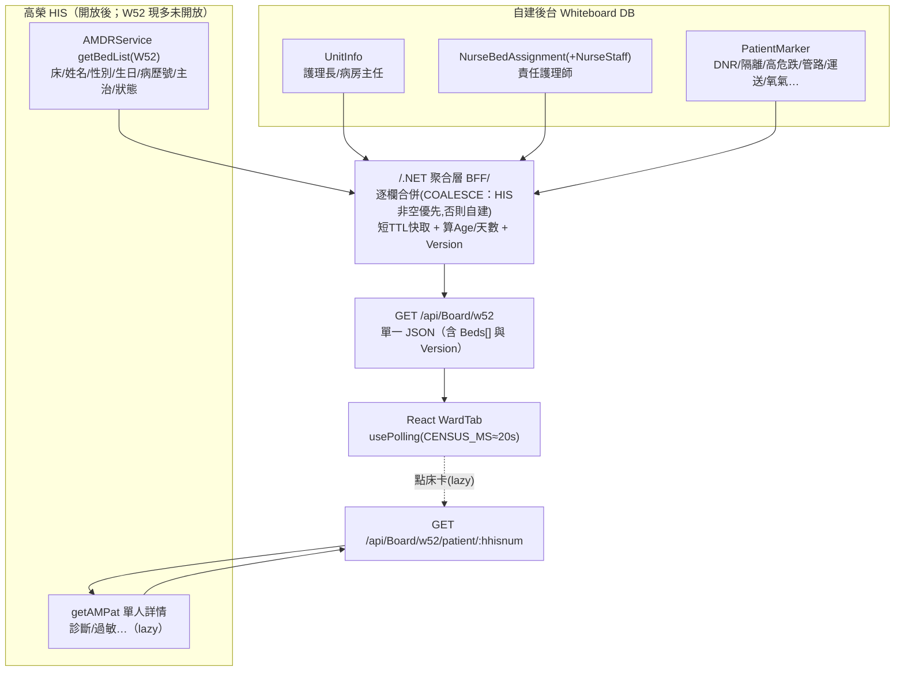

# W52 病室動態 — 試作 JSON 與資料組裝

> 目標：依**目前狀態**試作 W52 病室動態（`WardTab`）所需 JSON、逐欄資料來源、以及「一次取得 vs 組合」的 API 策略（含效能）。
> 前提：W52 為住院病房，**目前無開放 API**（唯一開放是急診 [[Board_ER]]）；多數臨床欄位屬空值或未開放（[[欄位資料實況]]）→ 現以自建/暫存為主，HIS 開放後逐欄切換。
> 關聯：[[資料庫Schema]]（自建表/合併策略）、[[HIS可用與缺漏分析]]、[[資料項對照表]]、[[即時更新-輪詢設計]]。

## ⚠ 實測更新（2026-06-22）
✅ 確認可用：床位 `AM.HLOC`(HNURSTA/HBED)、科別 `HSECTION`、**主治 `HDOCTOR`(HDOCNAMC/HMDTYPE)**、診斷 `HDIAGNOS`(HDIAGTXT)。⛔ 空值→自建：DNR(`HDNRSIGN`/`HICDNR`/`HDNRCASE`)、保密(`HMRLOCK`)、安寧、血型/身高體重、轉院(`HOSPTRIN`/`HOSPTROU`)、候床(`HWBDDT` 異常)。詳 [[欄位資料實況]]。

## 一、試作 JSON（貼合前端 `mockData` 結構，可直接替換 `MOCK_DATA`）
```json
{
  "HospitalInfo": {
    "HospitalName": "高雄市立民生醫院",
    "WardName": "W52病房", "WardCode": "W52",
    "WardDirector": "吳○明", "HeadNurse": "林○芳"
  },
  "Version": 1718000000,
  "Beds": [
    {
      "BedId": "W52-001", "Status": "occupied",
      "Patient": {
        "PatientName": "林○志", "Gender": "M", "Age": 75,
        "MedicalRecordNo": "A112345678", "BirthDate": "1950/03/15",
        "Department": "骨科", "AdmissionDate": "05/08",
        "Diagnosis": "Hip fracture, Post-OP Day 3",
        "AttendingDoctor": "張○醫師", "PrimaryNurse": "陳○護理師",
        "Condition": "穩定",
        "Dnr": true, "Isolation": "無", "FallRisk": true, "Dependency": null,
        "Confidential": false, "NoTreatment": false, "Npo": false,
        "Allergy": false, "Rrt": false, "Chemo": false,
        "Transport": "輪椅", "Oxygen": false, "Renal": false,
        "PortCath": false, "DLVC": false, "Foley": false, "CVC": false, "CardiacCath": false,
        "Surgery": false, "Exam": false, "Consult": false,
        "Notes": ""
      }
    },
    { "BedId": "W52-006", "Status": "isolation", "Patient": { "PatientName": "王○豪", "Gender": "M", "Age": 58, "MedicalRecordNo": "C334567890", "Department": "感染科", "AdmissionDate": "05/10", "Diagnosis": "Cellulitis, MRSA", "AttendingDoctor": "李○醫師", "PrimaryNurse": "鄭○護理師", "Condition": "重症", "Dnr": false, "Isolation": "接觸隔離", "FallRisk": false, "Consult": true, "Notes": "接觸隔離，需手套與隔離衣" } },
    { "BedId": "W52-030", "Status": "empty", "Patient": null }
  ]
}
```
> 註：欄位採 PascalCase 以**直接相容** `WardTab`（`bed.BedId`/`p.PatientName`）；.NET 端序列化需設 PascalCase 或前端加 mapping。`Version` 供輪詢比對（見 [[即時更新-輪詢設計]]）。

## 二、逐欄資料來源（三態 × 表搭配）
> 狀態：①有值(HIS直用) ②空值(HIS有欄位但空→自建) ③未開放/無(自建)；候選=有表但民生資料待智皓確認。

| 欄位 | 來源 | HIS 表.欄位 / 自建表 | 現況 |
|---|---|---|---|
| BedId / Status | HIS | `AM.HLOC` HNURSTA+HBED；`HCASE` HPATSTAT/HWBDDT、`HDISCHRG` HDISRVDT | 待開放 |
| PatientName/Gender/BirthDate(Age)/MedicalRecordNo | HIS | `AM.HPBASIC` HNAMEC/HSEX/HBIRTHDT/HHISNUM | ①有值 |
| Department | HIS | `AM.HSECTION` HCURSVCL/HCURDESC | 候選 |
| AdmissionDate | HIS | `AM.HCASE` HADMDT | 候選 |
| Diagnosis | HIS | `AM.HDIAGNOS` HDIAGTXT | 候選(可能空) |
| AttendingDoctor | HIS | `AM.HDOCTOR` HDOCNAMC(+HMDTYPE) | 候選 |
| **Dnr** | 自建 | (HPBASIC.HDNRSIGN ②**空值**) → `PatientMarker` | ②→自建 |
| **Confidential** 保密 | 自建 | (HPBASIC.HMRLOCK ②空值) → `PatientMarker` | ②→自建 |
| **Isolation** 隔離 | 自建 | (護理紀錄 ③) → `PatientMarker` | ③→自建 |
| **FallRisk** 高危跌 | 自建 | (護理評估 ③) → `PatientMarker` | ③→自建 |
| **管路** Port/DLVC/Foley/CVC/CardiacCath | 自建 | (護理紀錄 ③) → `PatientMarker`(MarkerCode=LINE, MarkerValue) | ③→自建 |
| **Transport/Oxygen/NoTreatment/Rrt** | 自建 | (護理紀錄/醫令 ③) → `PatientMarker` | ③→自建 |
| Dependency 依賴度 | 自建(預留) | 民生不用 → 留空 | ➖ |
| Npo 禁食 | 候選/自建 | `OR.OPORDER` ORNPODT(手術NPO) | 候選 |
| Allergy 過敏 | 候選 | `MR.EMRTRE` HALERGY、`ER.ETROOT` ETDRUG | 候選(可能空) |
| Chemo 化療 | 候選 | `UD.UDORDER` UDDCJUST | 候選 |
| Renal 洗腎 | 自建/候選 | `TR.TRORDER` TRPROCED 過濾 | ③→自建 |
| Surgery/Exam/Consult 旗標 | 候選 | `OR.OPORDER`、`OR.ORDER`(檢查/會診) | 候選(聚合計算) |
| Condition 病況等級 | 自建 | — → `PatientMarker`/留空 | 自建 |
| **PrimaryNurse** 責任護理師 | 自建 | (HIS主護未開放) → `NurseBedAssignment`＋`NurseStaff` | ③→自建 |
| Notes 備註 | 自建 | — → `PatientCensus`/`PatientMarker` | 自建 |
| WardDirector/HeadNurse | 自建 | — → `UnitInfo` | 自建 |

> 小結：**41 床的「列表級」欄位**大多可由 1 支 HIS 清單 API（開放後）取得；**註記/管路/責護/病況** 一律走自建覆蓋層；逐欄以「HIS 非空才用、否則自建」合併（[[資料庫Schema]] 欄位級 COALESCE）。

## 三、API 組合策略：一次取得 vs 組合（含效能）
**結論：不可能「單一 HIS API 一次取得」**（HIS 給不了註記/責護，且空值欄位要自建）。
採 **後端聚合（BFF）為單一端點**，前端一次取得；後端內部才做多源組合 + 快取。

### 推薦：後端聚合端點 `GET /api/Board/w52`
後端一次組裝、回傳完整看板 JSON：
1. **list 級（1 次 HIS 呼叫）**：`AMDRService getBedList(W52)` → 全床 + 病人基本 + 主治 + 狀態（**勿逐床 getAMPat**）。
2. **自建批量（各 1 次 DB 查詢）**：`UnitInfo`(1 列)、`NurseBedAssignment`(本日/班)、`PatientMarker`(本單位 active；含管路)。
3. **逐欄合併**：HIS 值非空白優先，否則自建；②空值/③未開放欄位直接取自建。
4. **快取**：結果短 TTL（≈15–20s，對齊輪詢 `CENSUS_MS`），多台白板共用，不重壓 HIS。
5. 回 `Version`（各源 max(UpdatedAt)）供輪詢比對。

### 詳情 lazy（避免效能陷阱）
點床卡開 modal 才呼叫 `GET /api/Board/w52/patient/{hhisnum}` → `getAMPat`(單人) ＋ 該病人 markers。**不在列表頁逐床呼叫**。

> 效能要點：`getBedList` 1 次 vs `getAMPat` ×41（每筆可能數秒）差異巨大；列表頁只用清單 API＋自建批量（≈1 HIS + 3 DB），快取後前端每 ~20s 1 次往返即可。

## 四、組裝流程圖


## 五、落地註記（目前狀態）
- W52 無開放 API → **現階段 `Beds[]` 由自建/暫存資料供應**（必要時 51/52 病房先上線，第5次會議）；HIS 開放後把 list 級欄位切 `HIS_THEN_MANUAL`。
- 自建表（`UnitInfo`/`NurseBedAssignment`/`PatientMarker`…）需先建（待院方確認 schema，見 [[資料庫Schema]]、[[待辦清單]]）。
- 聚合端點與 `FieldSourceMap` 一併實作，空值欄位設 `MANUAL_ONLY`（[[欄位資料實況]]）。

相關：[[W52-一般病房]] · [[資料庫Schema]] · [[欄位資料實況]] · [[即時更新-輪詢設計]] · [[Board_ER]] · [[00-總覽]]
